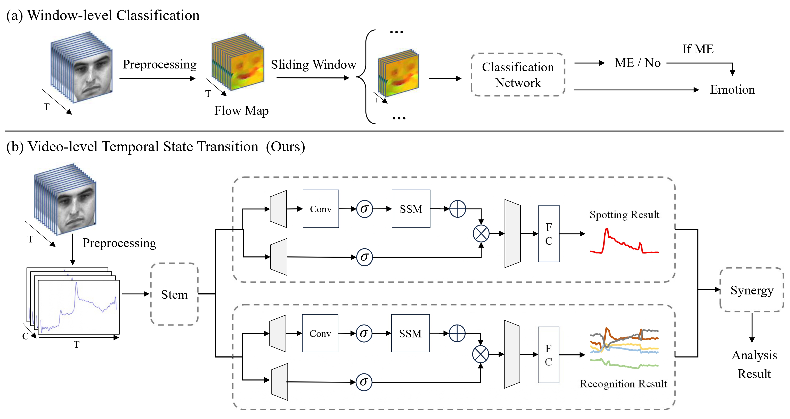

# ME-TST+




## 🔧 Setup

STEP1: `bash setup.sh`

STEP2: `conda activate ME-TST`

STEP3: `pip install -r ./requirements.txt` 


## 💻 Example of Using Pre-trained Models

If you want to run the pre-trained model on SAMMLV, use `python main.py --dataset_name SAMMLV --train False`

Note: The preprocessed data and pre-trained models on the CASME_3 dataset can be obtained through the link:  https://drive.google.com/drive/folders/1ire62tgZtyvKesYpxUIr9XPV-gRC-yfF?usp=sharing


## 💻 Examples of Neural Network Training

STEP 1: Download the $CAS(ME)^3$ raw data by asking the paper authors

STEP 2: Modify `main.py; load_excel.py; load_images.py`

STEP 3: Run `python main.py --dataset_name CASME_3 --train True`


## 🎓 Acknowledgement

We referred to [MEAN_Spot-then-recognize](https://github.com/genbing99/MEAN_Spot-then-recognize), and would like to express our sincere thanks to the authors.


## 📜 Citation

If you find this repository helpful, please consider citing:

```
@inproceedings{zou2025synergistic,
  title={Synergistic Spotting and Recognition of Micro-Expression via Temporal State Transition},
  author={Zou, Bochao and Guo, Zizheng and Qin, Wenfeng and Li, Xin and Wang, Kangsheng and Ma, Huimin},
  booktitle={ICASSP 2025-2025 IEEE International Conference on Acoustics, Speech and Signal Processing (ICASSP)},
  pages={1--5},
  year={2025},
  organization={IEEE}
}

@misc{guo2025metst+,
      title={ME-TST+: Micro-expression Analysis via Temporal State Transition with ROI Relationship Awareness}, 
      author={Zizheng Guo and Bochao Zou and Junbao Zhuo and Huimin Ma},
      year={2025},
      eprint={2508.08082},
      archivePrefix={arXiv},
      primaryClass={cs.CV},
      url={https://arxiv.org/abs/2508.08082}, 
}
```
